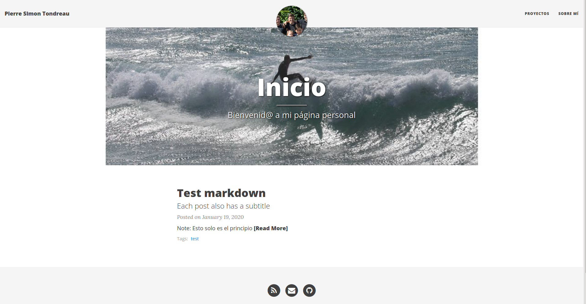

# P8 T3 Jekyll Netlify

Repositorio que contiene información acerca de la práctica p8-t3-jekyll-netlify

## Tutorial Paso a Paso

La primera parte de la práctica es realizar el [tutorial paso a paso](https://jekyllrb.com/docs/step-by-step/01-setup/).

Una vez finalizado el tutorial el resultado de la página es el siguiente

## Tema Jekyll

Con el tutorial finalizado se ha decidido incluir un tema a la página de Jekyll. El tema que se ha decidido usar es [Beautiful Jekyll de daattali](https://github.com/daattali/beautiful-jekyll#readme).

Para incluirlo en nuestra página, se ha realizado un `git clone` del proyecto y se ha incluido los archivos del tema. Adicionalmente se han realizado un par de modificaciones en el archivo de configuración para introducir nuestros datos.

El resultado final es el siguiente.

## Despliegue a Netlify

Para realizar el despliegue a Netlify ha sido necesario realizar un fork del repositorio `ULL-MII-SYTWS-1920/p8-t3-jekyll-netlify-PierreSimT` dado que Netlify no tiene acceso a los repositorios bajo la organizacion `ULL-MII-SYTWS-1920`.

Una vez realizado el fork seleccionamos desde Netlify el repositorio que va a desplegar, y la carpeta del despliegue.

Netlify se ocupará del resto. El despliegue de este proyecto se puede encontrar en <https://hopeful-hopper-568f29.netlify.com/>
